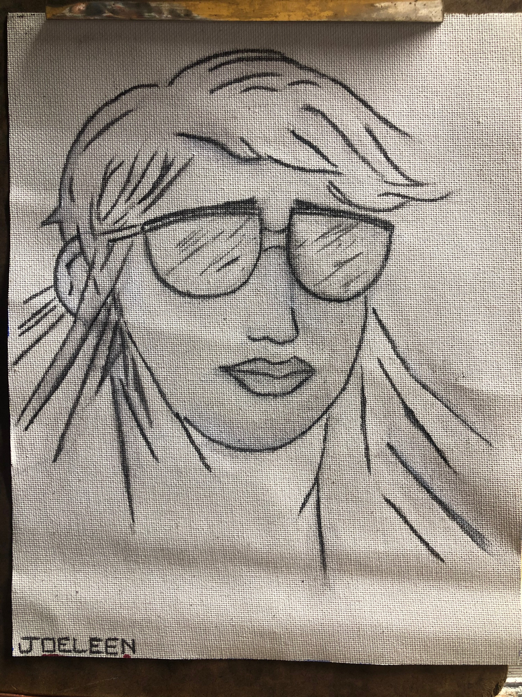

# REACT GALLERY

## The Gallery of your life

_Duration: 15hrs_

I am Full Stack Engineer. But overarching that--along with every other aspect of my life--, I am an artist. We artists rely on self advertisement, if the desire is to land work. The online Gallery enables the Visual Artist/Full Stack Engineer to have a consistent and efficient gallery of the entirety of their collection.

## Screen Shot

### Prerequisites

- [Node.js](https://nodejs.org/en/)
- [React.js](https://reactjs.org/)

## Installation

1. Clone the https://github.com/JoelleKado/react-gallery.git repository to your local machine.
2. navigate to `public/images` folder. This is your portfolio. Insert your work in .jpg form.

## Enter the Gallery

1. In Terminal 1: run commmand: `npm run server`: This will open the Gallery
2. In Terminal 2: run commmand: `npm run client`: This will enter you into the Gallery; The Virtual Gallery will open in your default web browser.
3. Enjoy. Have your friends view your gallery. They can `like` your works, and, toggle an artist's description for each work.

## Acknowledgement
Thanks to [Prime Digital Academy](www.primeacademy.io) who equipped and helped me to make this application a reality. Thank you https://github.com/freder48, https://github.com/bradybaker: Your collaboration with me on client-to-server communication was tantamount to the Gallery being likable. 

## Support
If you have suggestions or issues, please email me at [jkado@my.hpu.edu](www.google.com)
